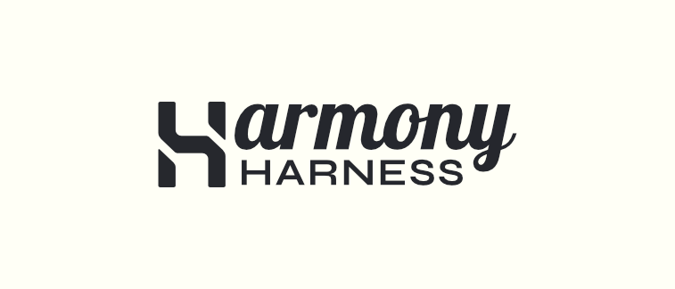

# Harmony

Harmony is an open-source, Rust-native, UI-first replacement runtime for fragmented AI coding workflows.

This repo holds the public product thesis and early brand direction.

- [Product thesis](about.md)
- [Brand assets](brand/README.md)
